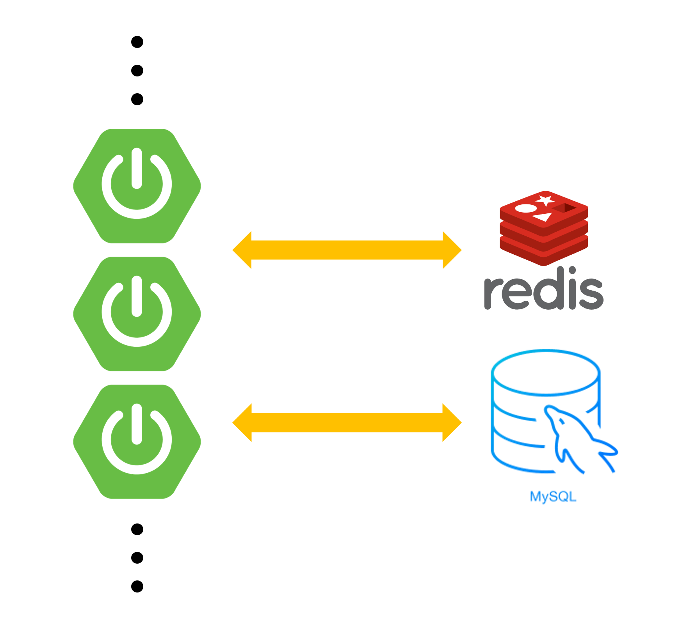
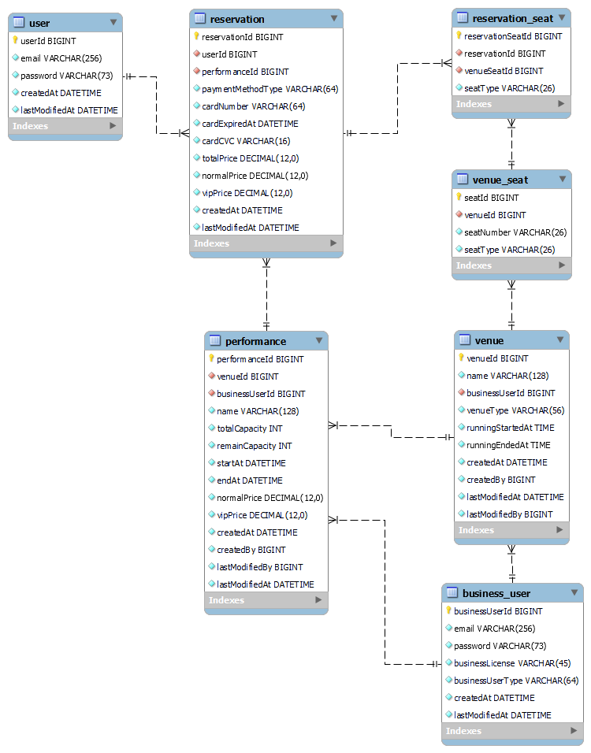

공연 예매 서비스 프로젝트입니다.

다중 서버 / 단일 DB / 단일 Redis 환경을 가정하고, 분산 락을 이용해 동시성 문제를 해결하기 위해 만든 프로젝트입니다. 

## 기술 스택
Spring 2.7.13, Hibernate 5.6.15, QueryDSL 5.0.0

## Architecture Layout

## 1. ERD

- 사용자는 특정 공연을 여러 좌석을 선택해서 여러 번 예매를 할 수 있습니다.
    - 하나의 예매는 여러 좌석을 포함할 수 있다. 하나의 좌석은 여러 예매(공연A, 공연B)에 포함될 수 있습니다. Reservation과 VenueSeat은 N 대 N 관계이기 때문에 ReservationSeat이라는 Entity를 뽑아냅니다.
- 초기 modeling 과정에서 reservationSeat에 seatType이 존재하지 않았고, reservation에 performance의 normalPrice, vipPrice column이 존재하지 않았습니다. 이 경우 관리자가 performance의 가격을 변경하거나 VenueSeat의 type을 수정할 경우, 이미 추가된 reservation에서 가격 정보를 계산할 경우 데이터 불일치 발생할 수 있을 것 같습니다. 데이터가 중복될 수 있지만 결국 reservation은 그 당시의 venueSeatType의 정보와 performance 가격 정보를 capture한 정보라고 봐야한다고 생각하여, 이들을 가지고 있어야 하고 그 공연의 정보나 좌석 정보를 수정하더라도 side effect이 사라지게 되므로 이들을 추가하도록 수정했습니다.
- performance의 capacity는 총 cap과 남은 cap으로 나눠서 관리합니다. 

## 2. 동시성_문제 및 해결 과정

1. 공연 예매 비즈니스 상, 많은 예매 요청이 한번에 요청될 가능성이 높으므로, DB 단의 비관적 락이나 낙관적 락은 성능상으로 이슈가 생길 것 같다고 판단했습니다. 그러므로 Application에서 `Redis`를 활용해 `분산 락`을 걸어서 해결하는 방향으로 좋겠다고 판단했습니다. 
    
2. Spring 기반 Redis 라이브러리는 Redisson과 Lettuce이 있습니다. Redisson은 pub-sub 방식으로, Lettuce는 spin lock 방식으로 Redis를 사용합니다. spin lock 방식에서는 동시에 수많은 스레드가 lock을 획득하기 위한 대기 상태가 발생할 경우, Redis에 부하가 발생할 수 있습니다. pub-sub 방식의 경우, lock이 해제되면 다른 스레드가 바로 lock을 획득할 수 있으므로, 상대적으로 더 적은 부하를 받게 됩니다. 성능 상의 이점을 생각했을 때, Redisson을 사용하기로 했습니다. 
    
3. 동시성 이슈가 생길 수 있는 데이터는 예약좌석(reservationSeat)과 performance의 capacity 데이터입니다. 두 데이터에 performance와 독립적으로 Lock을 걸어버리면 동시성 이슈를 해결할 수 있다고 생각했고, Lock의 key는 **`Performance:”performanceId”`** 과 같이 결정했습니다. 
    
4. Test Code 상으로 처음에 진행했을 때는 performance의 remain capacity가 실제 요청 받은 capacity가 다른 경우가 존재했습니다. 어떤 부분이 문제였을까 둘러본 결과, 비즈니스 로직에서의 트랜잭션 범위가 문제였습니다. 비즈니스 로직 내부에 Lock를 거는 바람에 트랜잭션이 커밋되기 전에 다른 스레드의 요청이 처리되어, 동시성이 깨지는 현상이 발생했습니다. 아래 Flow와 같이, Lock을 먼저 건 다음, 트랜잭션이 사용된 비즈니스 로직을 사용하여 문제를 해결했습니다. 

- Lock 획득
- Transaction 시작
- Reservation Logic 처리
- Transaction 커밋
- Lock 반납

## 3. 추가 고려사항

1. 결제 취소 로직도 고려해본다. 결제가 취소된다면, 트랜잭션도 모두 롤백 되어야하므로 일단 결제도 트랜잭션 내에서 처리하도록 한다.  
2. 결제 API가 트랜잭션 내에서 묶여있기 때문에 결제 요청 이후 트랜잭션 rollback이 되는 상황에는 결제 취소가 요청이 되어야 한다. 이를 위해서 transaction event listener를 활용하여 rollback이 되는 경우 결제 취소 요청을 하도록 하자.
3. 조회의 경우 Querydsl을 활용하여 구현하자. 

## 4. 보완사항

1. 락 재시도 Retry 로직 추가
    - Lock을 획득하지 못한 경우, Retry를 일정 횟수 수행하도록 해서 Client에서 Error를 줄일 수 있을 것 같다. 
2. Lock의 모듈화
    - SpEL, AOP 등 기술들을 활용하면, 단순 어노테이션으로 Lock을 사용할 수도 있을 것 같다. 
3. Test Coverage 측정